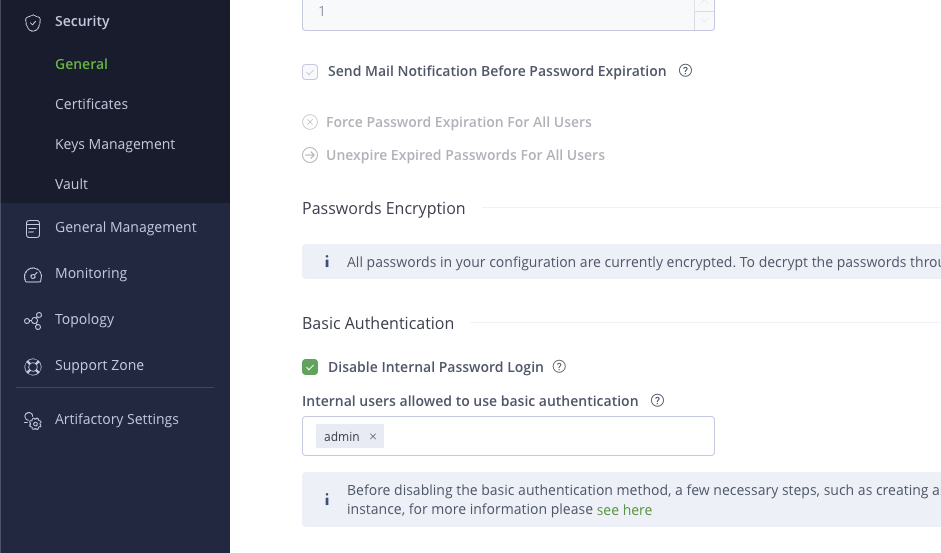

## Keycloak SSO Configuration

After you've entered the license information, one can now configure OAuth SSO through UDS Keycloak.

This package auto creates a client within the UDS Realm. Login to Keycloak to fetch the `client_id` and `client_secret`.

The client id will be `uds-package-artifactory` and you can get the secret under `Credentials` tab from client details.

In addition, you will need these URLs to configure the provider.

* Auth URL
* API URL
* Token URL

The following will provide all three: `https://sso.<your-domain>/realms/uds/.well-known/openid-configuration`

### Artifactory OAuth SSO Setup

Start here and click `Create New Provider`

Once at the `Add New OAUTH Provider` screen, give your provider name [**Note**: This can't be changed once created and it's what you see on the home screen.]

Next, select `OpenID` from the profivder type dropdown

Fill in all the infos from above. should look like this:

Click Save and you'll see it in the list available.

### Enabling OAuth

**Enabling OAuth SSO disables internal password authentication by default!** 

To change this setting, deselect the 'Disable Internal Password Login' checkbox in Security > General.
For enhanced security, we strongly recommend keeping basic authentication disabled.

You can add the admin user to ensure access for admin user until fully setup. 

